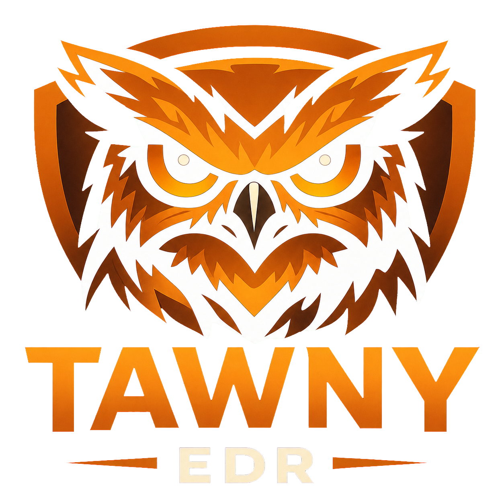
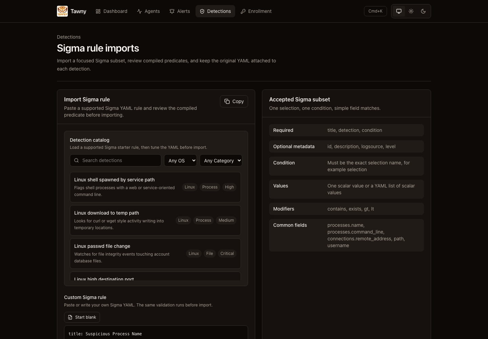
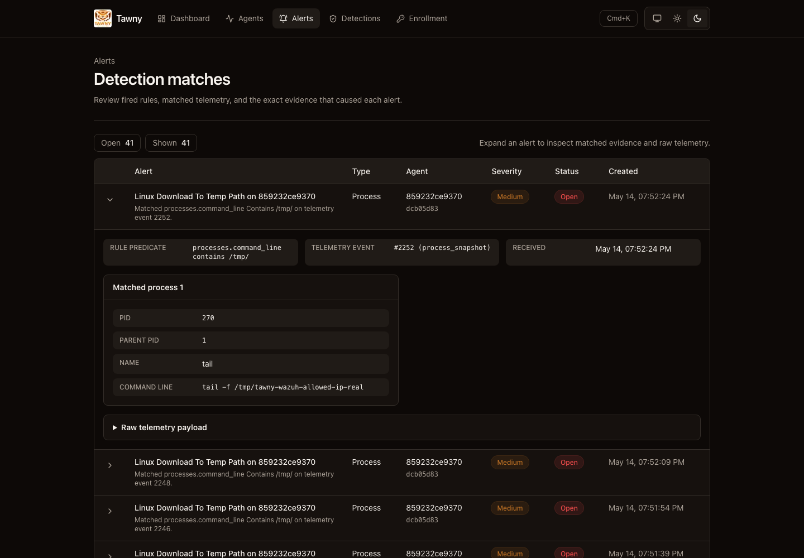
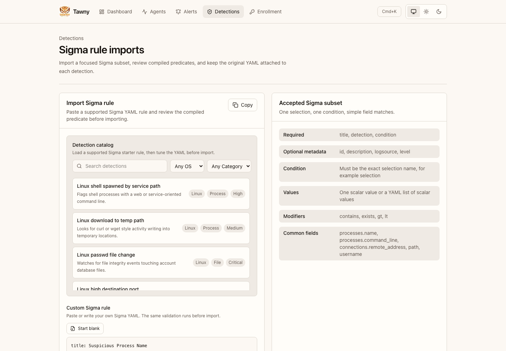
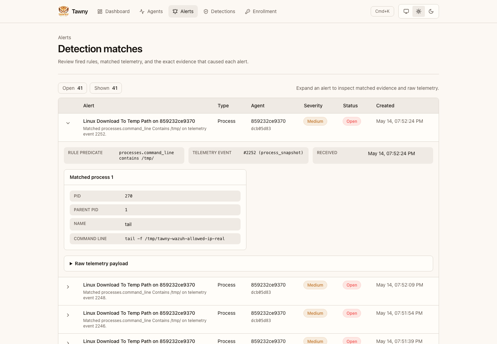
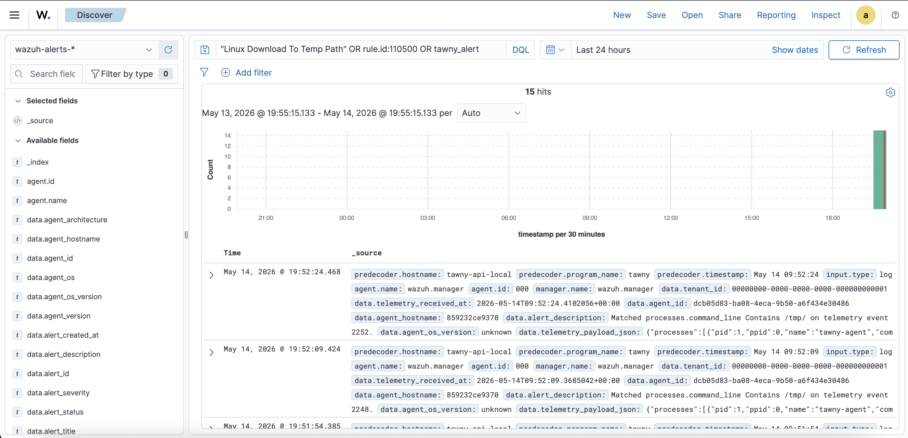
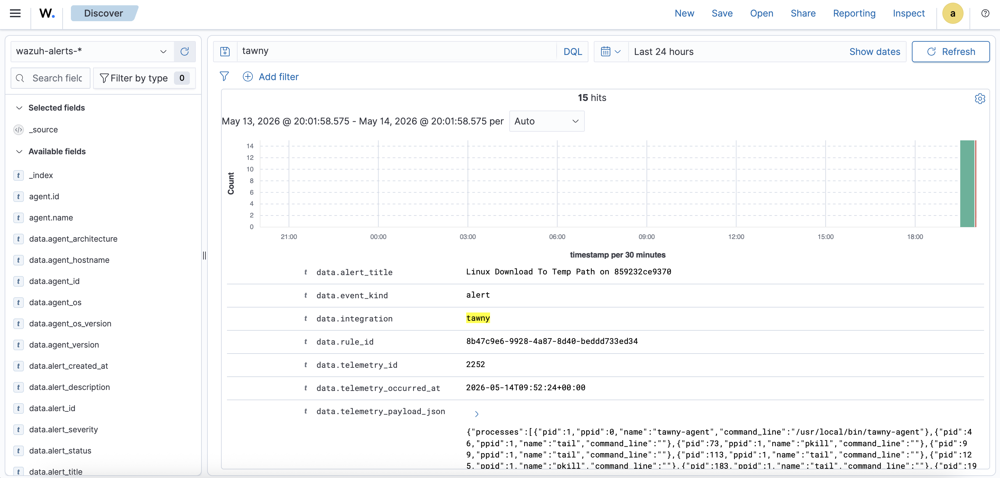

<p align="center">
  
</p>

# Tawny

> Quiet eyes on every endpoint.

Tawny is a self-hosted, lightweight EDR (endpoint detection and response) system. A tiny Zig agent runs on Windows, macOS, and Linux, ships telemetry to a .NET 10 backend over HTTPS, and surfaces it through a polished Next.js 16 dashboard. Hangfire handles offline detection, retention, backups, and agent update checks.

The MVP is intentionally small. No kernel hooks, no driver signing, and no attempt to replace a SIEM. Clean architecture, real telemetry, Wazuh alert forwarding, and a UI that looks like a product.

## Screenshots

<details open>
<summary><strong>Dark mode gallery</strong></summary>







</details>

<details>
<summary><strong>Light mode gallery</strong></summary>







</details>

<details open>
<summary><strong>Wazuh integration</strong></summary>





</details>

Generate README-ready product screenshots from the running Docker stack:

```bash
cd web
pnpm screenshots:readme
```

The script logs in with the local bootstrap admin, forces dark mode by default, and writes screenshots to `docs/screenshots/`. To capture light mode as well:

```bash
TAWNY_SCREENSHOT_THEME=light TAWNY_SCREENSHOT_OUT_DIR=docs/screenshots/light pnpm screenshots:readme
```

## Why "Tawny"?

Tawny is named after the tawny frogmouth, an Australian nocturnal bird famous for sitting perfectly still on a branch and being mistaken for part of the tree. It watches everything around it, makes no noise, and only acts when it needs to. That is roughly the job description of a good EDR agent: blend in, observe quietly, raise the alarm when something is worth your attention.

The tawny frogmouth is also small, unassuming, and frequently underestimated. The agent is a single Zig binary measured in kilobytes. The bird and the binary share a philosophy: do one thing well and stay out of the way.

## Architecture

```
+------------------------+        HTTPS         +-------------------------+
| Zig Agent              | -------------------> | .NET 10 API             |
| (Windows/macOS/Linux)  |  JWT, batched JSON   | ASP.NET Core            |
|                        |                      | EF Core + SQL Server    |
+------------------------+                      | Hangfire (in-process)   |
                                                +-----------+-------------+
                                                            |
                                                            v
                                                +-------------------------+
                                                | SQL Server 2022         |
                                                +-------------------------+
                                                            ^
                                                            | REST (cookie auth)
                                                +-------------------------+
                                                | Next.js 16 Dashboard    |
                                                | Better Auth, shadcn/ui  |
                                                +-------------------------+
```

See [docs/architecture.md](docs/architecture.md) for the deeper version.

## Repo layout

```
tawny/
  agent/      # Zig agent
  backend/    # .NET 10 solution (Api / Domain / Infrastructure / Jobs / Tests)
  web/        # Next.js 16 dashboard
  docker/     # docker-compose for local dev
  docs/       # architecture, threat model, API
  .github/    # CI + release workflows
```

## Quickstart (local dev)

Requirements:

- Docker 24+
- macOS Apple Silicon: enable Docker Desktop's x86/amd64 emulation/Rosetta support for SQL Server, or pass `--platform linux/amd64`
- .NET 10 SDK, Node 22 + pnpm 10, and Zig 0.14+ only if you want to work outside Docker or build the agent locally

```bash
# macOS / Linux
docker/scripts/bootstrap-docker.sh

# macOS Apple Silicon, if SQL Server needs amd64 emulation
docker/scripts/bootstrap-docker.sh --platform linux/amd64
```

```powershell
# Windows PowerShell
.\docker\scripts\bootstrap-docker.ps1
```

The bootstrap scripts generate local secrets, start SQL Server + API + Web, apply API and web database migrations, seed the first admin user when the database is empty, and verify the local HTTP endpoints. They default to web `3000`, API `5080`, and SQL Server `1433`, but automatically pick the next available host port when one is already in use.

Open the dashboard at the URL printed by the script. It is usually:

```text
http://localhost:3000
```

Default local login:

```text
Email: admin@example.com
Password: ChangeMe123!
```

Override the local admin during bootstrap:

```bash
BOOTSTRAP_ADMIN_EMAIL='you@example.com' \
BOOTSTRAP_ADMIN_PASSWORD='better-local-password' \
docker/scripts/bootstrap-docker.sh
```

```powershell
.\docker\scripts\bootstrap-docker.ps1 -AdminEmail "you@example.com" -AdminPassword "better-local-password"
```

Create an enrollment token from the `/enrollment` page, then run the agent against your local backend:

```bash
cd agent
zig build run -- --enrollment-token wte_xxx --backend http://localhost:5080
```

To test telemetry end to end entirely in Docker, start the real Linux agent container:

```bash
docker/scripts/bootstrap-docker.sh --with-agent
```

```powershell
.\docker\scripts\bootstrap-docker.ps1 -WithAgent
```

Or create an enrollment token in the dashboard and start it against an already-running stack:

```bash
cd docker
printf 'TAWNY_AGENT_ENROLLMENT_TOKEN=wte_xxx\n' >> .env
docker compose -p tawny --env-file .env --profile agent up -d --build agent
docker compose -p tawny --env-file .env --profile agent logs -f agent
```

The container runs the same Zig agent binary used on hosts. Its first start consumes `TAWNY_AGENT_ENROLLMENT_TOKEN`, writes a persistent config into the `agent-state` volume, and then heartbeats and posts Linux process, network, system, session, and FIM telemetry through the normal agent APIs.

Agent detail event tabs poll for fresh telemetry every two seconds by default. Use Pause to freeze the table while inspecting payloads. SSE streaming is intentionally deferred to v0.2; the current polling route is marked with `X-Tawny-Event-Feed: polling`.

EF migrations live in `backend/src/Tawny.Infrastructure/Migrations`. Automatic migration application is opt-in with `Tawny__ApplyMigrationsOnStartup=true` or `TAWNY_APPLY_MIGRATIONS_ON_STARTUP=true` in `docker/.env`. For production, leave that flag off and run:

```bash
cd backend
dotnet ef database update --project src/Tawny.Infrastructure --startup-project src/Tawny.Api
```

## Why Zig?

Zig produces small, static binaries and cross-compiles to Windows, macOS, and Linux from one machine without a fleet of toolchains. The C interop story is excellent, which matters when you are calling `CreateToolhelp32Snapshot` on Windows, `sysctl` on macOS, and procfs-backed collectors on Linux. No runtime, no GC, predictable memory. A good fit for an endpoint agent that has to live quietly inside other people's machines.

## Why this stack?

.NET 10 with EF Core and Hangfire keeps the backend boring and productive. Hangfire's SQL Server storage means one database to operate. Next.js 16 with the App Router and Server Components keeps the dashboard fast and lets us colocate data fetching with the views that need it. Better Auth handles email/password and GitHub OAuth without owning a session store. shadcn/ui plus Tailwind keeps the visual surface coherent without designing from scratch.

## Not in scope for MVP

This is a portfolio MVP. To keep it shippable in a sprint, the following are explicitly out:

- Multi-tenancy
- Real-time streaming (polling for now; SSE in v0.2)
- Alerting rules engine
- Kernel-level collection (ETW, EndpointSecurity)
- Code signing and notarisation (ship SHA256 in releases, sign later)

## Roadmap

- [x] Repo and CI scaffold
- [x] Backend skeleton: enrollment, heartbeat, JWT
- [x] Zig agent skeleton: config, enroll, heartbeat loop
- [x] Next.js scaffold: login, agents list
- [x] Process collector end-to-end
- [x] Events ingestion + storage
- [x] Hangfire: MarkStaleAgents, PurgeOldEvents
- [x] Agent detail page with event timeline
- [x] Network + FIM collectors (polling)
- [x] Install scripts (Windows + macOS)
- [ ] Release workflow with cross-compiled agent artefacts
- [ ] Docs: architecture, threat model, deployment

Post-MVP: Linux agent (eBPF), kernel-level collection, broader Sigma coverage, response actions, multi-tenancy, OIDC SSO.

## Detection rules

Alert rules are moving toward Sigma-compatible detection-as-code instead of a custom Tawny rule language. The current importer accepts a focused Sigma subset: `title`, `id`, `description`, `logsource`, one named `detection` selection, a single-selection `condition`, and `level`. Tawny compiles that into its event matcher and keeps the original Sigma YAML with the rule so the supported subset can grow without inventing a parallel format.

## Wazuh sink

Tawny can forward generated alerts to Wazuh over syslog. Enable the sink by pointing the API at a Wazuh manager or syslog listener:

```bash
TAWNY_WAZUH_ENABLED=true
TAWNY_WAZUH_HOST=wazuh-manager.example.com
TAWNY_WAZUH_PORT=514
TAWNY_WAZUH_PROTOCOL=udp
```

Each alert is emitted as one syslog event with a flat JSON body containing Tawny tenant, agent, alert, rule, telemetry event, and matched telemetry payload fields. Configure Wazuh to accept syslog input from the Tawny API host, then install the decoder/rules in `integrations/wazuh/` so Tawny events appear as Wazuh alerts.

In Docker-based Wazuh deployments, check `/var/ossec/logs/ossec.log` after the first send. If Wazuh logs `Message from 'x.x.x.x' not allowed`, add that exact IP to the Wazuh syslog `<allowed-ips>` list and restart the manager container.

## Slack sink

Tawny can also post newly generated alerts to a Slack incoming webhook. Delivery state is stored on each alert as `not_configured`, `pending`, `sent`, or `failed` and is visible in the alerts table.

```bash
TAWNY_SLACK_ENABLED=true
TAWNY_SLACK_WEBHOOK_URL=https://hooks.slack.com/services/...
TAWNY_SLACK_USERNAME=Tawny
TAWNY_SLACK_ICON_EMOJI=:rotating_light:
```

## Security notes

- Agent JWTs are bearer tokens. Anyone with the file on disk can impersonate the agent. Mitigate later with the OS keystore.
- No Authenticode signing or macOS notarisation is in place yet. The install scripts verify release SHA-256 sidecar files when available, and both scripts accept an explicit `--sha256` / `-Sha256` value for pinned deployments.
- Enrollment tokens are single-use and short-lived. Rotate the signing key if leaked.
- SQL Server creds live in env vars; use Key Vault or similar in production.
- The agent runs as the local user in MVP, not as root or SYSTEM. Telemetry is limited accordingly.
- Response actions are queued through the API and dispatched on heartbeat. `kill_process` requires a positive `pid`; host isolation is represented as an action type but the current agent reports it unsupported until OS firewall handlers are implemented.

Production deployments must terminate TLS before traffic reaches the API or web containers. See [docs/production.md](docs/production.md) for a Caddy reverse proxy sample, rate-limit behavior, audit logging notes, and the OS keystore path for agent JWTs.

## Agent install scripts

The dashboard enrollment page templates the supported one-liners:

```powershell
irm https://raw.githubusercontent.com/jusso-dev/Tawny/main/agent/install/install.ps1 | iex; Install-TawnyAgent -BackendUrl 'https://api.example.com' -EnrollmentToken 'wte_xxx'
```

```bash
curl -fsSL https://raw.githubusercontent.com/jusso-dev/Tawny/main/agent/install/install.sh | sudo bash -s -- --backend-url 'https://api.example.com' --enrollment-token 'wte_xxx'
```

Both scripts write the platform default `config.toml`, download the latest matching release asset, verify SHA-256 when a release sidecar is present, and register the agent as a Windows service, macOS launchd job, or Linux systemd service. Use `-DryRun` on Windows or `--dry-run` on macOS/Linux to inspect local actions without changing the host.

## Production secrets

Agent JWTs must be signed by a stable RSA private key in production. Generate one with:

```bash
openssl genpkey -algorithm RSA -pkeyopt rsa_keygen_bits:2048 -out tawny-jwt-key
chmod 0600 tawny-jwt-key
```

Set `Tawny__AgentJwt__SigningKeyPem` to the PEM file path or the inline PEM value. In production, `AgentJwtService` refuses to start without a configured signing key. Docker compose mounts `docker/secrets` at `/run/secrets`; `docker/scripts/init-secrets.sh` creates `docker/secrets/tawny-jwt-key`, `TAWNY_WEB_HMAC_SECRET`, and `BETTER_AUTH_SECRET` for local development.

See [docs/threat-model.md](docs/threat-model.md).

## License

MIT. See `LICENSE`.
